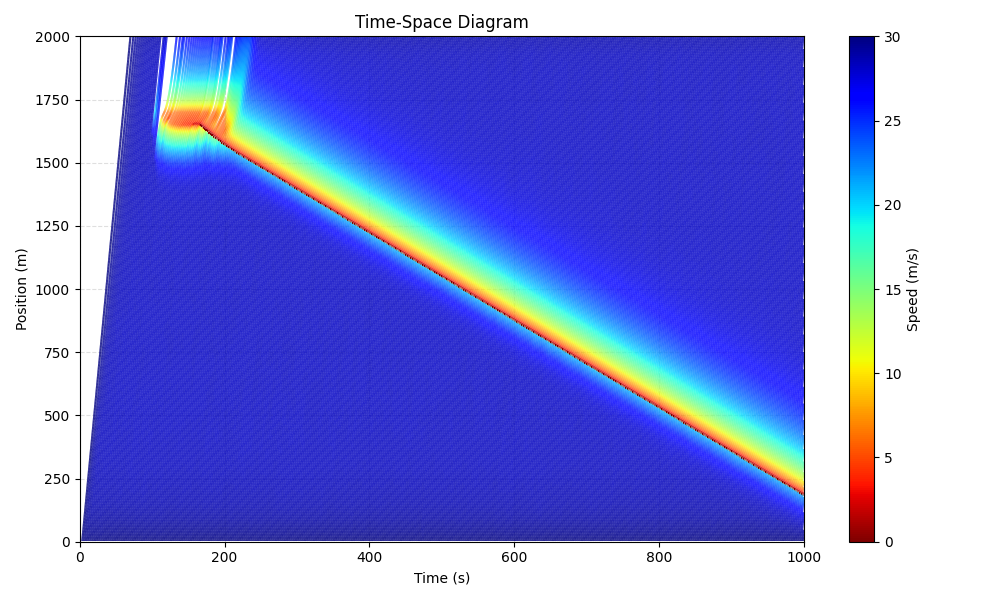
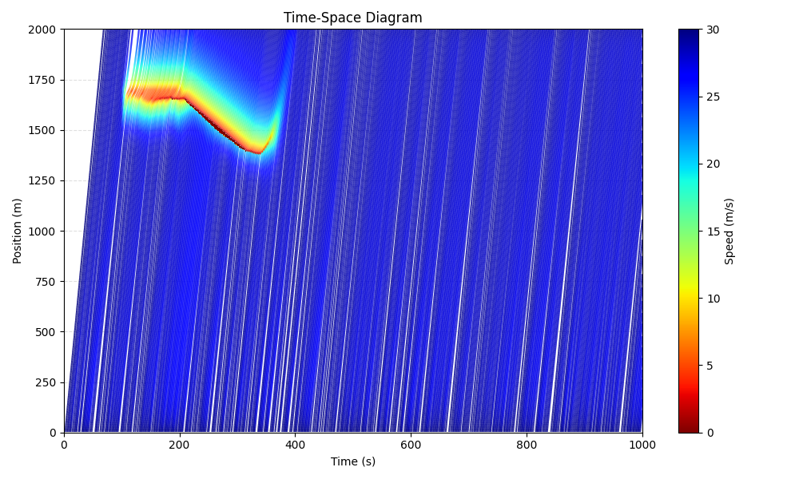
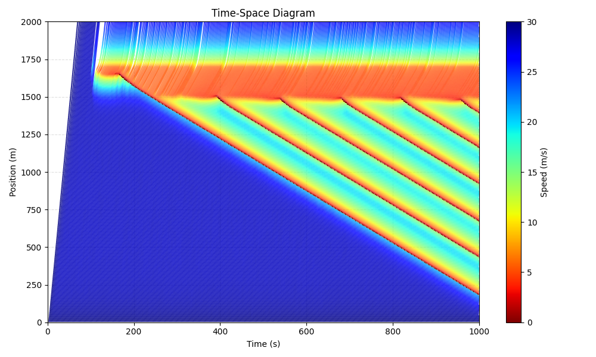
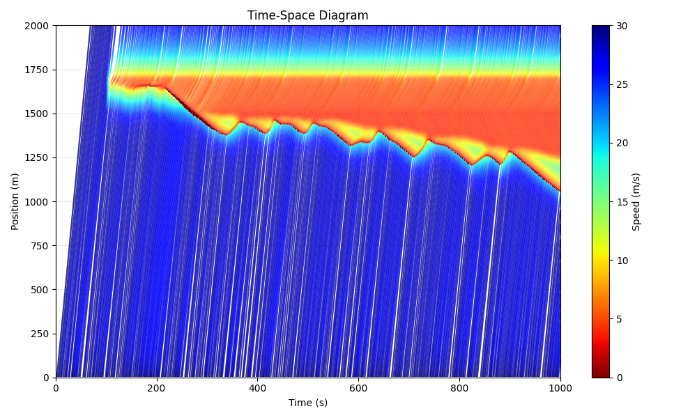
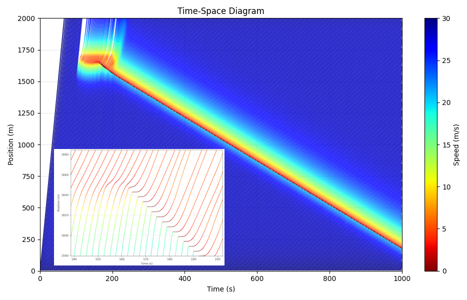

# Intelligent Driver Model on Straight Road 
The well-known **Intelligent Driver Model (IDM)** proposed by Martin Treiber et al (https://arxiv.org/abs/cond-mat/0002177). 

* **straight road**
* **bottleneck**
* **stop-and-go waves**
* **stochasticity**

# Versions and Observations

## Version 3 (v3): Stochastic inflow

Even though the inflow rate is the same, I found that its stochasticity has a substantial impact on the stop-and-go waves.
Take the following figures as examples: although the inflow is consistently around 1430~1440 veh/h, the resulting stop-and-go patterns differ substantially.

<table>
  <tr>
    <td align="center">
       
      Experiment 1: Deterministic Inflow (Short-lasting Bottleneck) 
    </td>
    <td align="center">
       
      Experiment 2: Stochastic Inflow (Short-lasting Bottleneck)
    </td>
  </tr>
  <tr>
    <td align="center">
       
      Experiment 3: Deterministic Inflow (Long-lasting Bottleneck) 
    </td>
    <td align="center">
       
      Experiment 4: Stochastic Inflow (Long-lasting Bottleneck) 
    </td>
  </tr>
</table>

## Version 2 (v2): Bottleneck

* **Bottleneck:** At the end of the road and during a given period, a mandatory deceleration segment was introduced as a bottleneck, which triggered stop-and-go traffic.
* **Driving noise:** A random noise was added to (the driver's perception of) relative speed. IDM itself seems too stable, and noise must be added to trigger stop-and-go. The problem is: if the noise is too large, traffic breaks down itself before arriving at the bottleneck.
* **Note 1:** Additional constraints must be incorporated into the IDM to prevent collisions. Otherwise, collision will occur.
* **Note 2:** The shape of the stop-and-go is highly influenced by the values of those IDM parameters. Sometimes, very sensitive. Many trial-and-error attempts are needed. It is also unclear if the stop-and-go pattern remains the same if traffic conditions are changed.
* **Note 3:** It seems also difficult to set a set of values which can perfectly make the wave speed between -20 and -10 km/h. Sometimes, it is too fast (-25km/h). When trying to slow it down, waves disappeared.

## Version 1 (v1): Preliminary framework

